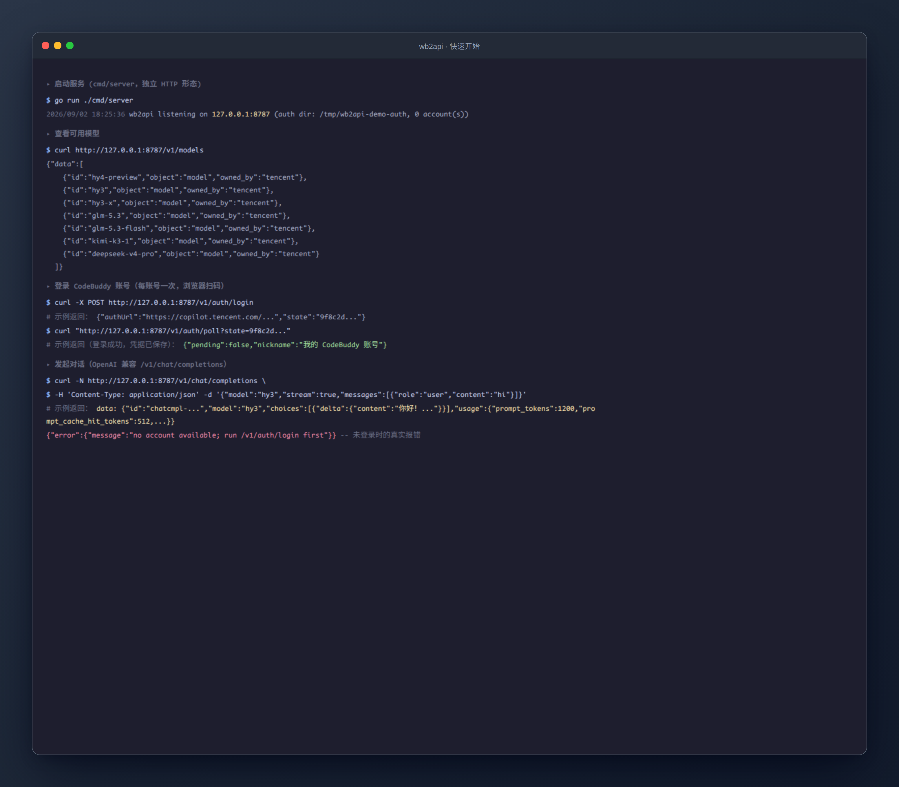

# wb2api — Tencent CodeBuddy/WorkBuddy 非官方反代

简单说：登录你自己的 CodeBuddy / WorkBuddy 订阅后，wb2api 会把它包装成一个
OpenAI 兼容的本地 API 服务，让 Claude Code、Codex CLI 等 AI 工具直接使用这个订阅。

> **非官方项目，与腾讯无关。** 需使用自有合法订阅，仅限个人学习研究，请遵守腾讯
> 服务条款。详见文末[合规](#合规)。

## 运行效果



## 快速开始

**1. 构建插件**

```bash
cd cmd/plugin && $GO build -buildmode=c-shared -o workbuddy.so .   # 需 Go 1.26+ 与 gcc
cp workbuddy.so <宿主目录>/plugins/linux/amd64/
```

**2. 在宿主 CLIProxyAPI 中启用并登录**

编辑宿主 `config.yaml`：

```yaml
plugins:
  enabled: true
  dir: "/abs/path/to/plugins"      # 放 workbuddy.so 的目录
  configs:
    workbuddy:
      enabled: true
auth-dir: "~/.cli-proxy-api"       # 默认目录，登录凭据写在这里
api-keys:
  - "<你的-api-key>"
```

登录走宿主自带流程（`/v1/auth/login`，浏览器扫码/授权），完成后凭据保存到
`auth-dir`。

**3. 接入 Claude Code / Codex**

- **Claude Code**：编辑 `~/.claude/settings.json`：

```json
{
  "env": {
    "ANTHROPIC_AUTH_TOKEN": "<你的-api-key>",
    "ANTHROPIC_BASE_URL": "http://127.0.0.1:8317"
  },
  "model": "hy3"
}
```

- **Codex CLI**：编辑 `~/.codex/config.toml`：

```toml
model = "hy3"
model_provider = "workbuddy"

[model_providers.workbuddy]
name = "workbuddy"
base_url = "http://127.0.0.1:8317/v1"
wire_api = "chat"
```

宿主默认监听 `127.0.0.1:8317`；模型名用上游模型 id（`hy3`、`glm-5.3` 等）。

> 具体接入步骤以 CLIProxyAPI 官方文档为准：
> <https://help.router-for.me/agent-client/claude-code>（Claude Code）、
> <https://help.router-for.me/agent-client/codex>（Codex）。

## 合规

- 非官方项目：与腾讯无关，未获授权、无官方背书；请遵守腾讯服务条款与当地法律。
- 使用前提：必须拥有合法订阅；仅限个人学习研究，勿用于商业用途、转售或公开服务。
- 账号风控等风险由使用者自行承担。
- 以 **MIT** 发布，详见 `LICENSE` 与 `NOTICE.md`；仓库不包含第三方代码。
